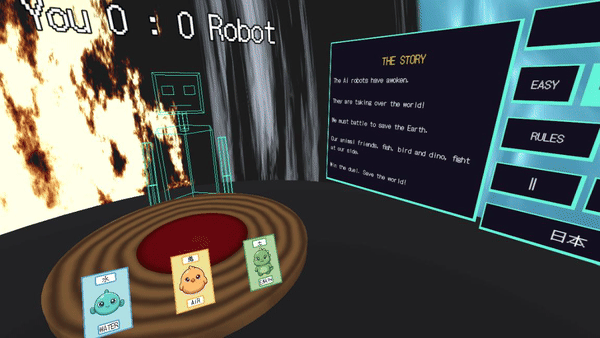
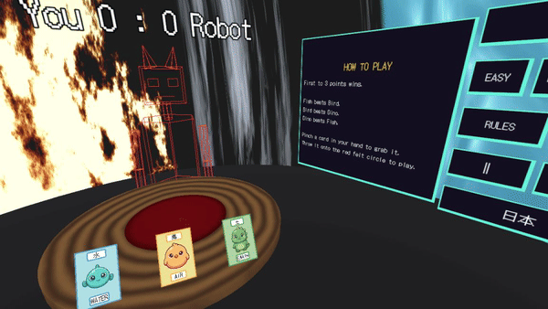

# 土風水競 — do-fu-sui-kyo

A single-player VR tabletop card game for the **Meta Quest 3**, built from scratch in
**Godot 4.7 / GDScript** with the [Godot XR Tools](https://github.com/GodotVR/godot-xr-tools)
addon. Made for **XR VisionDevCamp, Fukuoka 2026** (path P7 — Godot XR).

> **土風水競** — a coined four-kanji compound read *do · fū · sui · kyō* (earth · wind · water · compete).

---

## The scene

You stand at a table in an immersive VR room, walls glowing with stylised fire, waves, and
wind. In your hand: three little character cards — a **Fish**, a **Bird**, and a **Dino**.
Across the table, a glowing wireframe robot waits for its turn.

You grab a card, **throw** it into the arena, and the robot lays down one of its own. The two
critters land face-up — the winner **smiles**, the loser **cries**. First to three wins. The
charm and the physical throw are the whole pitch.

---





---

## How to play

It's rock-paper-scissors with critters:

| Card | Beats | Loses to |
|------|-------|----------|
| Water | Air | Earth |
| Air | Earth | Water |
| Earth | Fish | Bird |

- **Pinch** to grab a card, then throw it onto the red felt circle.
- The robot plays a card from its own hand; the round resolves by the table above.
- Same card = **draw** (both critters cry, no points).
- After each round both hands refill to three from a single shared deck. By round two your
  hand may not hold all three types any more — **that drift is the game.**
- **First to 3** wins. Then it restarts.

A four-button retro control panel sits at your right, within reach:

- **Restart** — fresh game + recenters you
- **Rules** — pops up a how-to-play card
- **Track** — cycles the looping background music
- **Language** — flips *all* in-game text between English and Japanese (EN ⇄ 日本)

---

## Key features

- **Physical throw-to-play** — grab and throw real cards using XR Tools' grab/throw physics.
- **Expressive faces** — each card is a 2D sprite swap (neutral / blink / determined / smile / cry);
  they blink at rest to feel alive. No rigging.
- **Wireframe robot opponent** — a procedural line-mesh character that reaches out, picks up its
  card, and lays it down, head tracking you the whole time. No model file, no skeleton.
- **Adjustable AI** — Easy / Medium / Hard. Medium plays blind random; Easy and Hard peek at your
  throw and aim for a target win rate (you win ~70% on Easy, ~20% on Hard).
- **Elemental room** — a circular shell with GPU-animated fire, waves, and wind bands; pure
  ambiance, zero per-frame script cost.
- **Bilingual** — every label, the scoreline, and the win/lose banner re-language from one toggle.
- **Retro soundtrack** — looping background music with skip/pause, ducked for win/lose/draw stingers.

---

## Structure

The architecture splits cleanly into a **headless logic brain** and a **VR presentation layer**.
All deck/hand/score/resolution logic lives in one pure-logic autoload with no scene
dependencies, so it's unit-tested on desktop without a headset.

```
GameState.gd          # THE BRAIN — pure logic autoload: deck, hands, scoring, RPS resolution.
                      #   The VR layer calls exactly one method: play_round(card).
game/
  GameRoot.gd         # logic→scene glue: spawns/clears the player's hand from GameState
  PlayZone.gd         # Area3D that detects a landed card and drives a round
  Card.tscn / CardFace.gd     # one grabbable node that also owns its sprite face
  RobotPlayer.gd      # procedural wireframe robot (look_at arm, no IK)
  RoomShell.gd + *.gdshader   # circular room + elemental wall shaders
  Hud.tscn / Hud.gd   # retro control panel (Viewport2Din3D)
  Lang.gd             # i18n: one flag + t(en, ja) — re-languages everything
  Music.gd            # looping soundtrack + track cycle + jingle duck
main.tscn             # the XR rig, table, robot, room, and HUD wired together
tests/                # headless assert tests for GameState.gd (the only real logic)
docs/                 # DESIGN.md (build plan) + FSD.md (requirements & test spec)
```

The logic brain is tested headless; the VR layer is verified in-headset.

---

## Building & testing

See [CLAUDE.md](CLAUDE.md) for the full toolchain. The checks CI enforces:

```sh
gdformat .                                                           # auto-format
gdlint .                                                             # lint
godot --headless --path . --script res://tests/test_game_state.gd   # logic tests
godot --headless --audio-driver Dummy --path . --script res://tests/test_music.gd  # music tests
```

Built on [Godot XR Tools](https://github.com/GodotVR/godot-xr-tools) (MIT). See
[`docs/DESIGN.md`](docs/DESIGN.md) and [`docs/FSD.md`](docs/FSD.md) for the design rationale
and full requirements spec.
